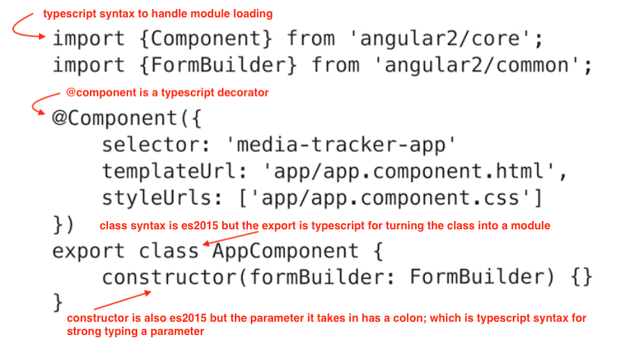

## ng4




- a component is a directive with a template
- directives provide functionality and can modify the dom
- two types of directives
  + structural (modifies layout through dom)
  + attribute (change the behaviour or apperance of an existing dom element)
- directives do not have a template
- you apply directives to an existing element or sometimes to a template element
- like component a directive gets configure with a selector that angular will
  use to find a match

```ex: 

    //1. writting an attribute on an element that matches your selector

    @Decorator({
        selector: 'myfavorite'
    })

    <div myfavorite>
      
    </div>


  ex: 
  
    //2. using the template syntax to add a directive

     @Decorator({
        selector: 'myfavorite'
    })

    <div [myfavorite]="true">
      
    </div>

    //3. built-in directives ex:

    *ngIf

    *ngFor

    routerLink

```

#### another tool for displaying data is the pipe ( | )

- pipe takes in data like a string or an array and runs some login to transform it
  to a new output
-  ex of built-in pipes are data, upper case, lower case

#### dependency injection (DI)

- is the concept of inversion of control, where you architect code in a way that you
  provide modules with other modules it needs to get some work done, instead of having
  your modules get other modules on their own.
- DI allows you to run decoupled code that is easier to unit test and work with.
  Alowing you to write these modular components/services within your applications and
  simply tell angular what you want to use. 
  + form builder component, 
  + http component, 
  + router componen
- Angular will then handle constructing instances of them and applying them to your code
  where needed.    

- the most common place to use DI is in your class Constructor.
  + ex

```
    Constructor(formBuilder: FormBuilder) {}

    // Constructors for components,directives, pipes and services you write
    // Angular will create an instance of that type
```

- service is typically a js class or function where we have encapsulated some logic

- when writting components, it is prefer to write the classes for these in a way that
  the class logic consists of only brokering data to and from the view (adding functionality to the view)
- Dont suppose to put application business logic in components and directives but on the
  service.

```
  ex. a component that needs to display a media item

  //you can write a js class that handles finding the record data and returning it
  //as an object --> that would be a service
      class MediaItemService {
          getById(id) {}
      }
  //then using angular DI framework specify that ur MediaItemComponent
  //is going to use that service
  //by requesting service from component logic and make it avail to view


```

```
    ex: Decorator

    @Component() {

      //component is the decorator name
      //starts with @
    }

    //for example: (module decorator, component decorator)
    @NgModule inside of app.module tells angular that it is an angular module
    @Component inside of app.component tells angular this is a component
  
```

metadata

```
    ex of metadata (are the properties inside of the decorator)

    
    @Component({
      selector: 'app-root',
      templateUrl: './app.component.html',
      styleUrls: ['./app.component.css']
    })

```